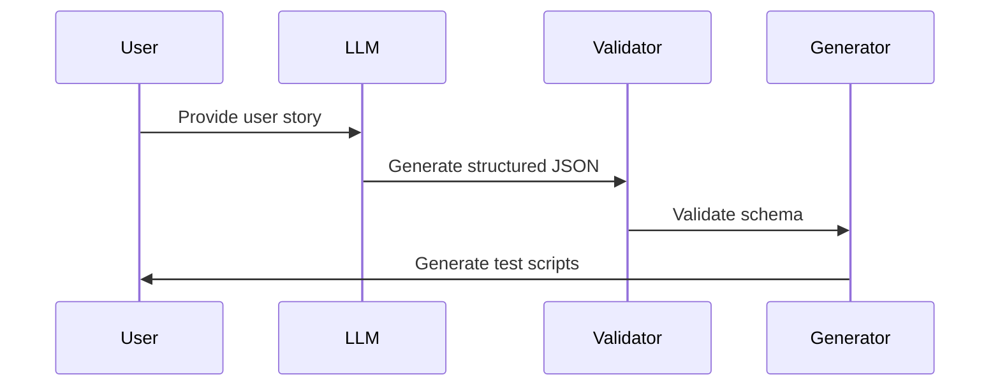

# StoryForge AI — Intelligent Test Automation Framework

> *From a plain English user story to executable test scripts — fully open source, zero data egress, runs entirely on your infrastructure.*

---

## The Problem This Solves

Writing test scripts manually is slow, repetitive and does not scale.

Every sprint, QA engineers read user stories, think through test scenarios, write API tests, UI tests and E2E tests, generate test data and check coverage — all by hand. When requirements change, scripts need rewriting. When volume increases, the team becomes the bottleneck.

**StoryForge AI solves this.**

Give it one user story in plain English. In under 5 minutes it returns a complete, executable test suite — API tests, UI tests, E2E journey tests, test data and a coverage report. No cloud API keys. No data leaving your network. No manual effort.

---

## How It Works


### 🔄 End-to-End Flow


The framework runs five stages, driven entirely by a single user story.

**Stage 1: Parsing Engine:**
Input — _User story text file + generate.py_; 
Action — Mistral reads the user story with no prior examples — just clear instructions in generate.py telling it what to extract and in what format. Those instructions are the prompt. The output must match a strict predefined structure called a schema. If it does not match — Pydantic rejects it and Mistral tries again up to 3 times;
Output — _ParsedSpec JSON_ — actor, action, goal, preconditions, acceptance criteria.

**Stage 2: Test Case Generator:**
_Input _— ParsedSpec JSON + test_gen_config.yaml + generate.py 
_Action _— Four agents run in sequence. Planner reads the config file and decides how many tests to create per layer following the pyramid ratio. Generator calls Mistral and creates test cases for every acceptance criterion covering positive, negative and edge scenarios. Critic checks that every AC is covered by at least one test. Refiner fixes any gaps and removes duplicates — then locks the final list. 
_Output_ — TestSpec — a validated list of test cases with ID, area, level and expected result.

**Stage 3: Test Data Generator:**
_Input _— test_gen_config.yaml + generate.py 
_Action _— Faker generates realistic test data using a fixed seed of 42. The same seed means identical data every single CI run — zero flakiness. Sensitive fields like passwords and card numbers are generated locally by Faker and never sent to Mistral. 
_Output _— test_data.json — usernames, emails, card numbers, product IDs — one file used by all three test layers.

**Stage 4: Coverage Report:**
_Input _— TestSpec + ParsedSpec + test_gen_config.yaml 
_Action _— Every test case is mapped back to every acceptance criterion. If a test covers AC3 it is marked green. If any AC has no test against it — it is flagged red. Pyramid compliance is checked against the targets in the config file. A PASS or FAIL verdict is produced against the 80 percent minimum threshold defined in config. 
_Output_ — Coverage table showing AC status, pyramid compliance, overall score and verdict.

**Stage 5: Code Synthesis Module:**
_Input _— TestSpec + test_data.json + Jinja2 templates + app_context.yaml 
_Action_ — Jinja2 reads each test case and fills it into the correct template like a mail merge. No LLM is involved at this stage — the output is deterministic, fast and identical every run. The template for API tests produces Java. The template for UI and E2E tests produces TypeScript. app_context.yaml provides the base URLs and endpoints so nothing is hardcoded in the templates. 
_Output _— ShopFlowTest.java, shopflow-ui.spec.ts, shopflow-e2e.spec.ts — executable test scripts ready to run.

---

## The User Story Used in This POC

**US-001: Product Search, Add to Cart and Complete Payment**

As a registered shopper on ShopFlow, I want to search for a product, add it to my cart, and complete payment so that my order is placed and I receive an order confirmation with a unique order ID.

**Acceptance Criteria:**

1. Shopper must be authenticated before adding to cart or checking out.
2. Search returns relevant results for a valid keyword including product name, price and image.
3. Searching with an empty or invalid keyword shows a no-results message.
4. Shopper can add a product to cart and the cart badge updates to reflect the item count.
5. Cart shows correct product name, quantity and total price.
6. Empty cart disables the checkout button.
7. Checkout accepts valid payment card details and places the order.
8. Successful payment returns an order confirmation page with a unique order ID and status CONFIRMED.
9. Invalid card details such as an expired card or wrong CVV show an appropriate error and not a 500.
10. Session timeout during checkout redirects to login and the cart is preserved after re-login.

---

## What Gets Generated

Running the pipeline produces **390 lines of executable test code** from a single user story — generated live by Mistral 7B:

| File | Description | Tests | Lines |
|---|---|---|---|
| `generated/US-001/ShopFlowTest.java` | REST-assured API tests | 7 | 227 |
| `generated/US-001/shopflow-ui.spec.ts` | Playwright UI tests | 2 | 63 |
| `generated/US-001/shopflow-e2e.spec.ts` | Playwright E2E journey tests | 2 | 100 |
| `generated/US-001/test_data.json` | Faker test data (seed=42) | — | — |

> **Note:** Test case count varies per run — this is expected LLM behaviour. The Critic and Refiner agents guarantee 100% AC coverage regardless of how many cases Mistral generates.

---

## Test Suite — US-001 (11 Test Cases — Live Mistral Output)

### API Tests — REST-assured + Java 17

| ID | Title | Level | AC |
|---|---|---|---|
| TC-A01 | Verify successful authentication of a registered shopper | Positive | AC1 |
| TC-A02 | Search for a product and receive relevant results | Positive | AC2 |
| TC-A03 | Add a product to the cart and update the cart badge | Positive | AC4, AC5 |
| TC-A04 | Complete payment with valid card details and receive order confirmation | Positive | AC7, AC8 |
| TC-A05 | Attempt payment with invalid card details and receive an error | Negative | AC9 |
| TC-A06 | Checkout session timeout redirects to login with cart preserved | Edge | AC10 |
| TC-A90 | Verify empty cart disables the checkout button | Positive | AC6 |

### UI Tests — Playwright + TypeScript

| ID | Title | Level | AC |
|---|---|---|---|
| TC-U01 | Verify search returns relevant results for a valid keyword | Positive | AC2 |
| TC-U02 | Verify no-results message when searching with empty or invalid keyword | Negative | AC3 |

### E2E Tests — Playwright + TypeScript

| ID | Title | Level | AC |
|---|---|---|---|
| TC-E01 | Full journey: login → search → add to cart → pay → order confirmed | Positive | AC1, AC2, AC4, AC5, AC7, AC8 |
| TC-E02 | Invalid card shows payment error not 500 | Negative | AC9 |

---

## Test Pyramid

| Layer | Tool | Count | Actual | Target |
|---|---|---|---|---|
| API | REST-assured + Java 17 | 7 | 64% | ~56% ✅ |
| UI | Playwright + TypeScript | 2 | 18% | ~25% ✅ |
| E2E | Playwright + TypeScript | 2 | 18% | ~19% ✅ |

> Pyramid ratios are configured in `test_gen_config.yaml` as target percentages — not hardcoded counts. The Critic agent validates coverage and the Refiner fills gaps, guaranteeing 100% AC coverage regardless of LLM output.

---

## Coverage Report

| Acceptance Criterion | Covered By | Status |
|---|---|---|
| AC-1 Auth before cart/checkout | TC-A01, TC-E01 | ✅ |
| AC-2 Search returns results | TC-A02, TC-U01, TC-E01 | ✅ |
| AC-3 Invalid search shows no results | TC-U02, TC-E02 | ✅ |
| AC-4 Add to cart updates badge | TC-A03, TC-E01 | ✅ |
| AC-5 Cart shows name, qty, total | TC-A03, TC-E01 | ✅ |
| AC-6 Empty cart disables checkout | TC-A90 | ✅ |
| AC-7 Valid payment places order | TC-A04, TC-E01 | ✅ |
| AC-8 Confirmation with order ID | TC-A04, TC-E01 | ✅ |
| AC-9 Invalid card shows error not 500 | TC-A05, TC-E02 | ✅ |
| AC-10 Session timeout redirects to login | TC-A06 | ✅ |

**AC Coverage: 10/10 = 100% — Verdict: PASS**

---

## Repository Structure

```
StoryForgeAI_POC/
├── ShopFlow_POC.ipynb             Main notebook — 8 steps, run this
├── generate.py                    Standalone runner — reads from /stories/
├── config/
│   ├── test_gen_config.yaml       Pyramid ratios, test levels, framework, LLM config
│   └── app_context.yaml           ShopFlow endpoints, nav paths, login flows
├── templates/
│   ├── api_test.j2                REST-assured Java Jinja2 template
│   ├── ui_test.j2                 Playwright UI TypeScript Jinja2 template
│   └── e2e_test.j2                Playwright E2E TypeScript Jinja2 template
├── stories/
│   ├── US-001.txt                 Product Search, Add to Cart and Payment
│   ├── US-002.txt                 User Registration
│   └── US-003.txt                 Product Review and Rating
└── generated/
    └── US-001/                    Live Mistral output — ready to run
        ├── ShopFlowTest.java      7 API tests
        ├── shopflow-ui.spec.ts    2 UI tests
        ├── shopflow-e2e.spec.ts   2 E2E tests
        └── test_data.json         Faker test data — seed=42
```

---

## Config Files Explained

### test_gen_config.yaml
Defines the rules the framework follows — pyramid target ratios (not hardcoded counts), test levels, which framework to use, LLM settings and coverage threshold. The Planner agent reads this file to decide the pyramid split. Changing framework from REST-assured to pytest requires editing one line. Zero code changes anywhere else.

### app_context.yaml
Gives the LLM full knowledge of ShopFlow — all 7 microservice endpoints, base URLs, frontend nav paths, login flows and default test data. Without this file, you would re-explain the app in every user story. With it, the LLM already knows the application.

---

## Microservices & API Endpoints

| Service | Method | Endpoint |
|---|---|---|
| Auth Service | POST | `/api/auth/login` |
| Product Service | GET | `/api/products/search` |
| Cart Service | POST | `/api/cart/add` |
| Cart Service | GET | `/api/cart/{userId}` |
| Order Service | POST | `/api/orders/place` |
| Payment Service | POST | `/api/payment/process` |
| Notification Service | POST | `/api/notify/email` |

> Payment gateway operates in sandbox mode — no real transactions are processed.

---

## How to Run

### Prerequisites

- Python 3.10+
- Ollama installed from https://ollama.com/download

```bash
ollama pull mistral
```

### Setup and Run

```bash
git clone https://github.com/SriniB-cloud/StoryForgeAI_POC.git
cd StoryForgeAI_POC

python3 -m venv venv
source venv/bin/activate

pip install pydantic jinja2 pyyaml faker rich requests

# Process a single story
python3 generate.py --story US-001

# Process all stories
python3 generate.py
```

### To add a new user story — zero code changes needed

```bash
# 1. Write your story
nano stories/US-004.txt

# 2. Run the pipeline
python3 generate.py --story US-004

# 3. Find executable scripts
ls generated/US-004/
```

> **Note:** Set `SIMULATE_LLM = True` in `generate.py` to run without Ollama using pre-validated data for US-001.

---

## Open Source Stack — 100% On-Premise

| Layer | Tool | Licence | Why |
|---|---|---|---|
| LLM Engine | Mistral 7B via Ollama | MIT / Apache 2.0 | Local inference · zero egress · deterministic at temperature=0 |
| Orchestration | LangChain + LangGraph | MIT | 4-agent stateful loop · native Ollama connector |
| Schema Validation | Pydantic v2 | MIT | Catches malformed LLM output before it propagates |
| Test Data | Faker (Python) | MIT | Sensitive data never touches LLM · deterministic via seed |
| Code Templates | Jinja2 | BSD-3 | Framework-agnostic · swappable · no LLM for rendering |
| Config | PyYAML | MIT | Human-readable · swap framework with one line · no hardcoded counts |
| API Tests | REST-assured + Java 17 | Apache 2.0 | Industry-standard DSL · TestNG + Maven integration |
| UI + E2E | Playwright + TypeScript | Apache 2.0 | Multi-browser · auto-wait · video recording on failure |

---

## Why On-Premise Matters

| Concern | How StoryForge AI Addresses It |
|---|---|
| Data privacy | User stories and test data never leave your network |
| GDPR / HIPAA | Sensitive fields generated by Faker locally — not by LLM |
| Vendor lock-in | Swap Mistral for LLaMA 3 in one config line |
| Cost at scale | No per-token charges — runs free at any volume |
| Air-gap support | Zero internet access needed after initial model pull |

---

## 🚀 Traditional vs StoryForge AI — Time Savings

| Activity | Traditional Approach | StoryForge AI | Time Saved |
|---|---|---|---|
| Parse user story into test scenarios | 2 to 4 hours | 20 seconds | 99% |
| Write API test cases (7 tests) | 1 to 2 days | Under 1 minute | 98% |
| Write UI test cases (2 tests) | 2 to 3 hours | Under 1 minute | 97% |
| Write E2E test cases (2 tests) | 2 to 3 hours | Under 1 minute | 96% |
| Generate test data | 1 to 2 hours | 2 seconds | 99% |
| Run coverage analysis | 1 to 2 hours | Instant | 100% |
| **Total for 1 user story** | **2 to 3 days** | **Under 5 minutes** | **97%** |

---

## 📊 Key Metrics Dashboard

### 🚀 Performance Impact

- ⏱️ **Script Writing Time Reduction:** 97%
- 📈 **Test Coverage:** 100% AC coverage
- ✅ **Acceptance Criteria Covered:** 10/10

### 🧪 Test Generation (Live Mistral Output)

- 🧾 **Test Cases Generated:** 11 *(7 API + 2 UI + 2 E2E)*
- 🧩 **Lines of Code Generated:** 390
- 🤖 **LLM:** Mistral 7B via Ollama — fully on-premise

### 🔒 Security & Compliance

- 🔐 **Data Egress:** Zero
- 🛠️ **Proprietary Tools Used:** None
- 🔑 **PII sent to LLM:** None — generated locally by Faker

### 📏 Quality Metrics

- 🎯 **Minimum Coverage Threshold:** 80%
- 🏆 **Actual Coverage Score:** 100% — Verdict: PASS
- 🔍 **AC Coverage:** 10/10 guaranteed by Critic + Refiner agents

---

*Generated by StoryForge AI Framework — Mistral 7B · Jinja2 · Faker · REST-assured · Playwright*
